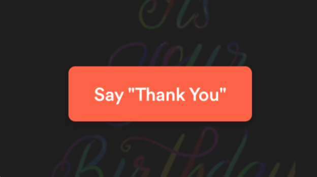
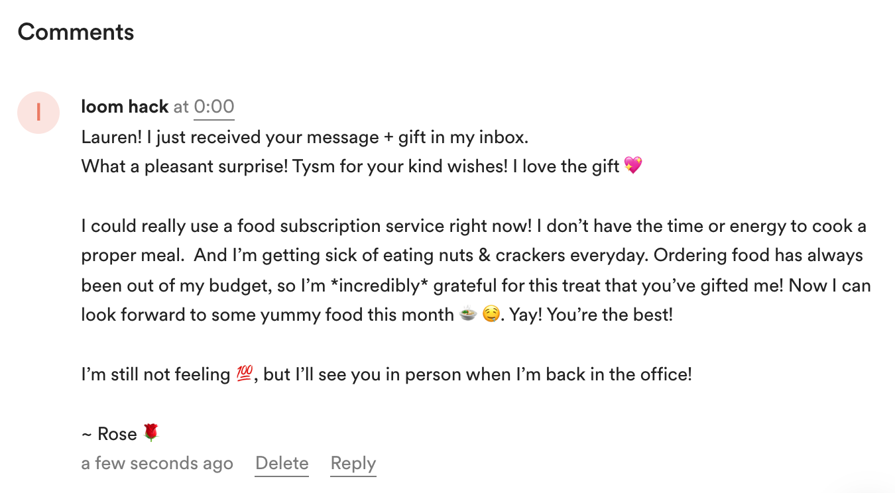
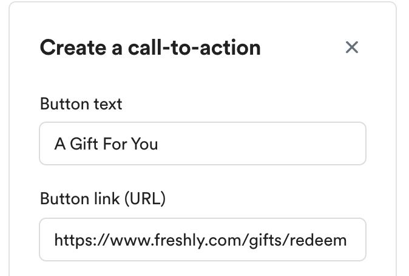
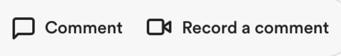
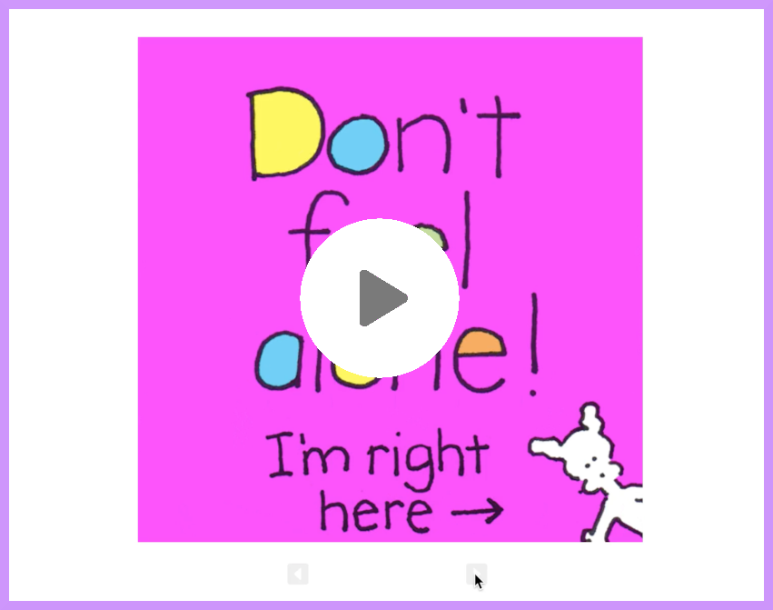
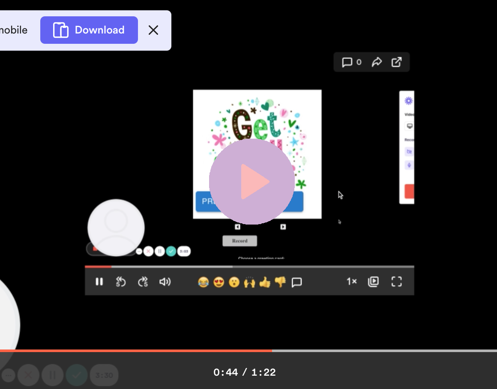
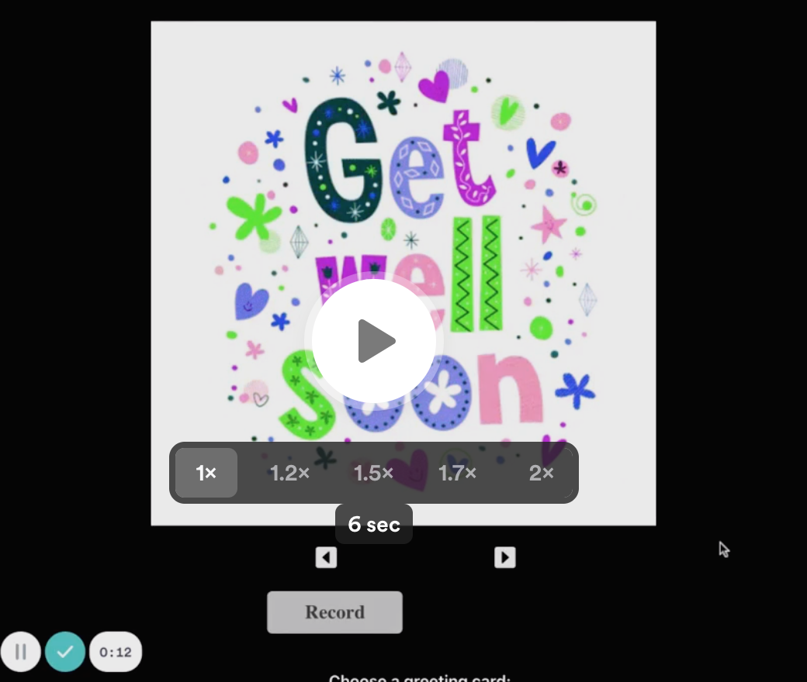
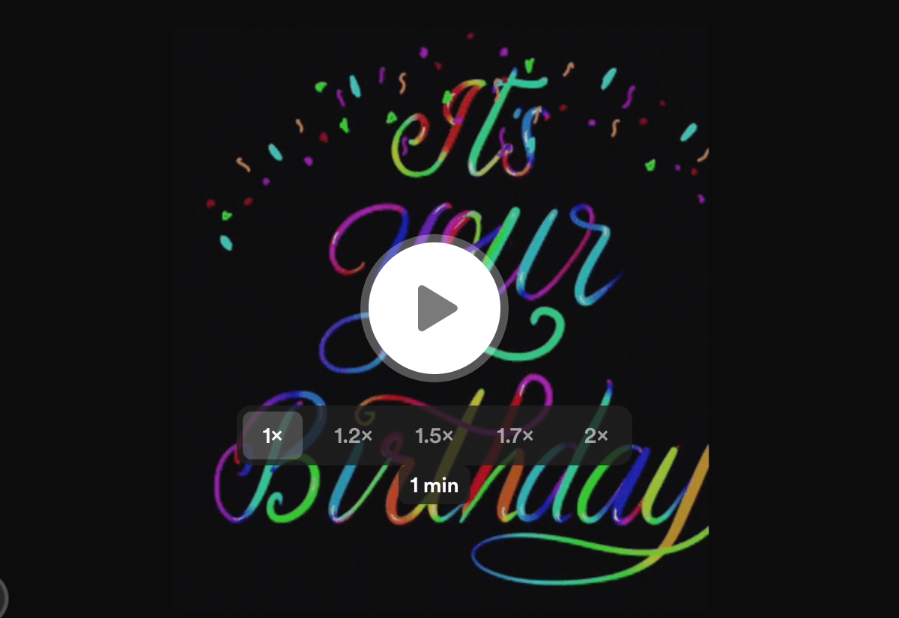
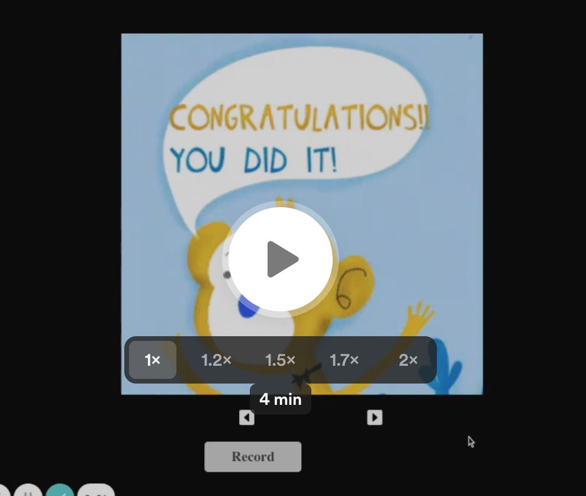

# Loom Greeting Kit

## Table of Contents 
**[Installation](#installation)** &nbsp;| &nbsp; **[Configure your environment](#configuring-your-environment)** &nbsp; | &nbsp; **[Description](#description)** &nbsp; | &nbsp; **[Screen Shots](#screen-shots)** &nbsp; | &nbsp; **[Action Items](#action-items)** &nbsp; |  &nbsp; **[Work Related Themes](#work-related-greeting-card-themes)** &nbsp; | &nbsp; **[Seeing Beyond](#seeing-beyond)** &nbsp; | &nbsp; **[Loom Demos](#loom-demos)** &nbsp; | &nbsp; **[Disclaimer](#disclaimer)**

 

## Installation 
1. Clone this repository
2. Run **`npm install`** to install all dependencies
3. Run **`npm start`** to start the React app on localhost:3000

 

### Configure your environment
Rename **`.env.example`** to **`.env`** and add your Loom API key.

 

## Description

Loom Greeting Kit: 
- 1 Greeting E-Card 🌇 + Video Message 📹 + Gift 🎁 + Love 💝 = ✨ Joy 🥰 ✨

- Send or receive an animated greeting or invitation card + a personal video message with a digitally wrapped gift. One-to-one or one-to-many direct greeting video messaging.

- Capture, save, collect, and trade special gifting moments, virtual gift receipts, and video memos that last a lifetime.

- For physical gift delivery, a gifter can schedule their Loom greeting kit to deliver upon estimated package delivery so that gift package arrival + video message receipt are in sync. Recipient can share a recording of themselves receiving & unwrapping their gift package with gifter for a virtually connected experience.

- Send best wishes, support, comfort, strength and encouragement to colleagues, bosses, remote teams in the workplace, through the holidays, and beyond 💚

- Improve employee retention, restore company faith, and boost morale at a time when a genuine show of worker appreciation is needed more than ever. 

 

More details in **[brainstorm/outline.txt](./brainstorm/outline.txt)**

 

## Screen Shots
 
<!--   
 

  

   -->

## Action Items
### Recipient response example - video comment
 

 

### E-Gift example via Loom CTA

### Sending Thanks & Appreciation 🙏
  

 

## Work Related Greeting Card Themes
- Employee Recognition, Client Appreciation, Company Awards
- Company Anniversary, Company Christmas & New Years' Party
- Birthdays, Get Well Soon Care Package, Best Wishes
- Congrats, Job Promotion, Job Well Done, Project Success
- Thank You, Apology, Farewell, Retirement, Maternity Leave
- Words of Encouragement, Special Announcement, New Hire Welcome Kit
 
 

## Seeing Beyond

### Beyond the Holidays + Workplace

Although this hack was made with the holidays + professional workplace in mind, I see it extending beyond those boundaries. Not everyone celebrates holidays or has days that they look forward to. A virtual greeting app has the potential to reach so many, including hospital patients, cancer patients, the chronically or terminally ill, anyone down on their luck who has lost their job, home, health or loved one, someone going through a life-changing event, pregnant soon-to-be mothers, etc. Greetings aren't only for holidays and celebrations. Words of support and encouragement can mean a lot, especially during hard times. Each have their own charm, but receiving a direct video message can be a much more personal, engaging, empowering and uplifting experience than a long, heartfelt text message alone.

Mainstream video + photo sharing platforms have also introduced and promoted short form videos. But their application is typically one-to-many, where one creator uploads a video to an audience of viewers. So it’s interesting to see Loom approach video sharing from a different angle. What if content creators, artists, influencers and vloggers could interact with their fans or followers 1-1 via async video messaging? This opens the door for a virtual fan meet and greet that can happen whenever & wherever because video messages aren’t time or location dependent. I believe this is something that both parties could appreciate, with the proper checks in place ofc.

My experience with commenting on the top social video sharing platform hasn't been all the best. I find that I, along with many others, have to keep reposting the same comment under any and every video that a creator uploads until it sticks because the comments automatically get removed at random (it's a hit or a miss)... possibly due to the length of my comments, although I can't say for sure. And the only way to even know whether or not a comment has gone through is to check while logged out. It's a whole tiresome process that can dissuade any viewer from commenting at all. (Ironically, YT's spam filter has only encouraged me to 'spam' even more 😁). All this to say, an advantage of communicating via Loom VM (video message) is that it can save time by possibly getting past those faulty spam text filters and condensing long text messages into easier-to-digest video recordings.

To demonstrate what this could look like, I turned a portion of my long text comments into a video message greeting:

### Text vs Video: Notice the difference?

### Non-Holiday + Non-Work Related Greeting Example

**🍀 Note**: An actual greeting VM would be more natural, more personal & engaging (think inside jokes, personal memos, photo collage, digital art, portraits, caricatures, sketches, spoken word, serenades, storytelling, etc). 

Now, if I sent this VM greeting to someone located halfway across the globe, they could watch it in their own time, replay the message however many times they want/need to hear it, and respond with their own Loom video or comment. This would then start a chain reaction of spreading positive vibes. Bonus points if you can get someone to smile or laugh with your greeting message. 

Not being able to respond to a comment to your comment cuts off the start of any discussion, which defeats the purpose of having a discussion thread in the first place 😑. Async audio messaging, voice memos & voicemail are already convenient communication tools for many. The future of async video adoption looks promising.

### The Weight of a Message
Proof of the <strong>✨</strong> positive impact <strong>✨</strong> that supportive comments & messages can have:

- Reading comments from other NICU moms and nurses is  
<a href="https://rebrand.ly/supportive-comments-impact" target="_blank">therapeutic for this one talented creator & amazing mother of three</a>.
> **👩🏼‍⚕️👩🏾‍⚕️👩🏻‍⚕️ + 🤰👩‍👦👩‍👧‍👦 + 🌍 + 💕💬 = ✨🤱🏻✨ + 💪**

<!-- > **✨ <a href="https://rebrand.ly/supportive-comments-impact" target="_blank">video link</a> ✨** -->

 

## Loom Demos
### Shorter Demo - Trimmed (1 min)

### Video Greeting Sample I - Spoken (< 1 min)

### Video Greeting Sample II - Music Video (1 min)

### Full App Demo (4 min)

➕ Click thumbnail to watch video in a new browser tab

 

### DISCLAIMER
All company names, logos, gift cards and gift card images are trademarks™ or registered® trademarks of their respective holders. Use of them does not imply any affiliation with or endorsement by them. All third party trademarks (including logos and icons) referenced in this project remain the property of their respective owners.

 

