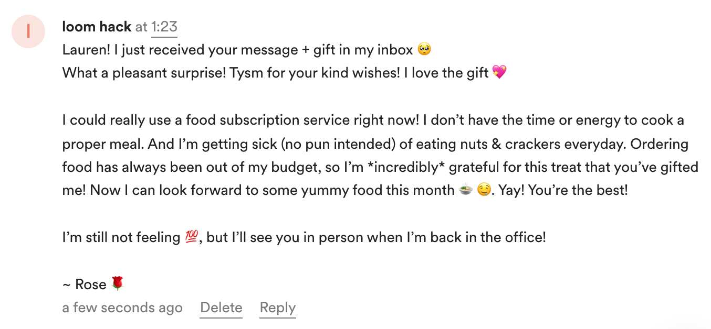

# Loom Greeting Kit

## Table of Contents 
**[Installation](#installation)** &nbsp;| &nbsp; **[Configure your environment](#configuring-your-environment)** &nbsp; | &nbsp; **[Description](#description)** &nbsp; | &nbsp; **[Loom Demos](#loom-demos)** &nbsp; | &nbsp; **[Screen Shots](#screen-shots)** &nbsp; | &nbsp; **[Action Items](#action-items)** &nbsp; | &nbsp; **[Disclaimer](#disclaimer)**

 

## Installation 
1. Clone this repository
2. Run **`npm install`** to install all dependencies
3. Run **`npm start`** to start the React app on localhost:3000

 

### Configure your environment
Rename **`.env.example`** to **`.env`** and add your Loom API key.

 

## Description

Loom Greeting Kit: 
- 1 Greeting E-Card 🌇 + Video Message 📹 + Gift 🎁 + Love 💝 = ✨ Joy 🥰 ✨

- Send an animated greeting card + a personal video message with a digitally wrapped gift. 

- Capture, save, collect, and trade special gifting moments, virtual gift receipts, and video memos that last a lifetime.

 

More details in **[brainstorm/outline.txt](./brainstorm/outline.txt)**

 

## Loom Demos
### Shorter Demo - Trimmed (1 min)

### Video Greeting Sample I - Spoken (< 1 min)

### Video Greeting Sample II - Music Video (1 min)

### Full App Demo (4 min)

➕ Click thumbnail to watch video in a new browser tab

 

## Screen Shots
 
<!--   
 

  

   -->

## Action Items
### Recipient response example - video comment
 

 

### E-Gift example via Loom CTA

### Sending Thanks & Appreciation 🙏
  

 

### DISCLAIMER
All company names, logos, gift cards and gift card images are trademarks™ or registered® trademarks of their respective holders. Use of them does not imply any affiliation with or endorsement by them. All third party trademarks (including logos and icons) referenced in this project remain the property of their respective owners.

